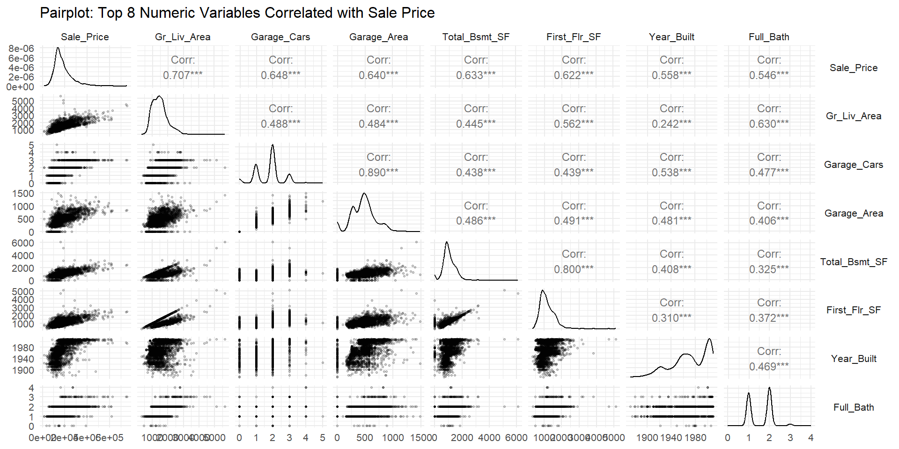
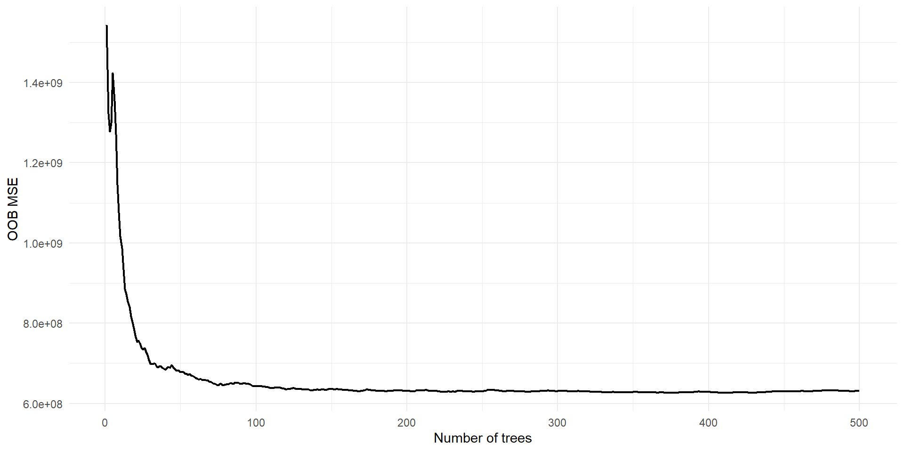
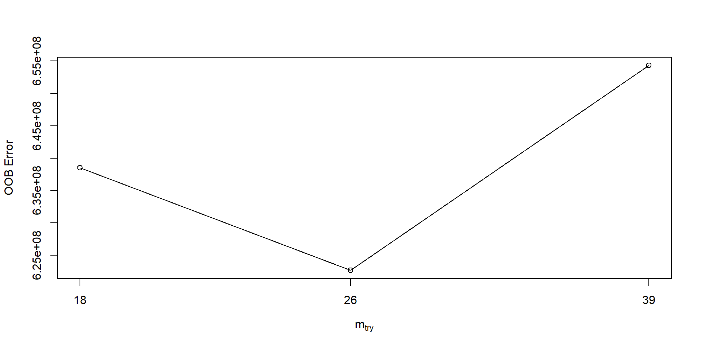
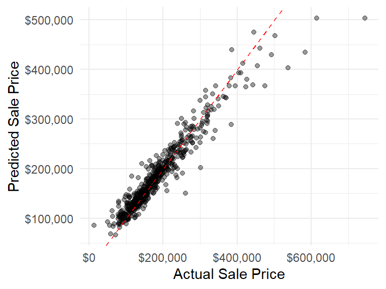
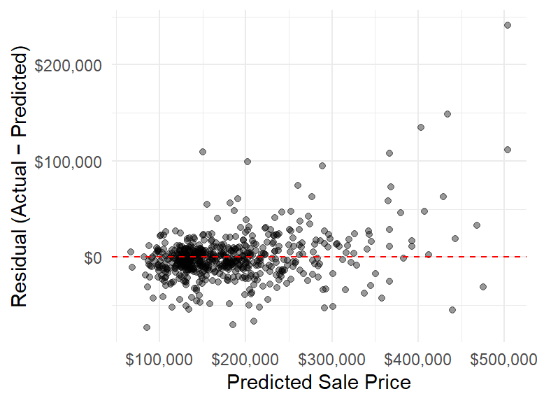
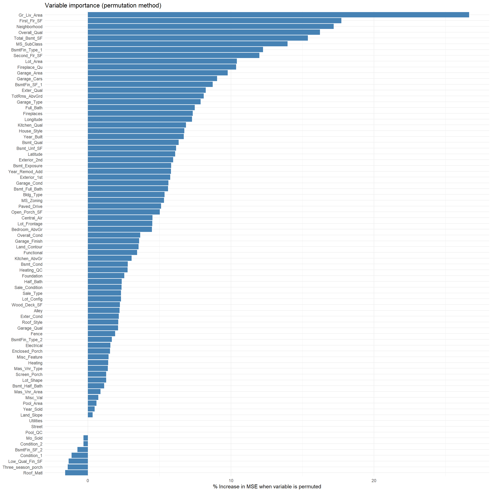
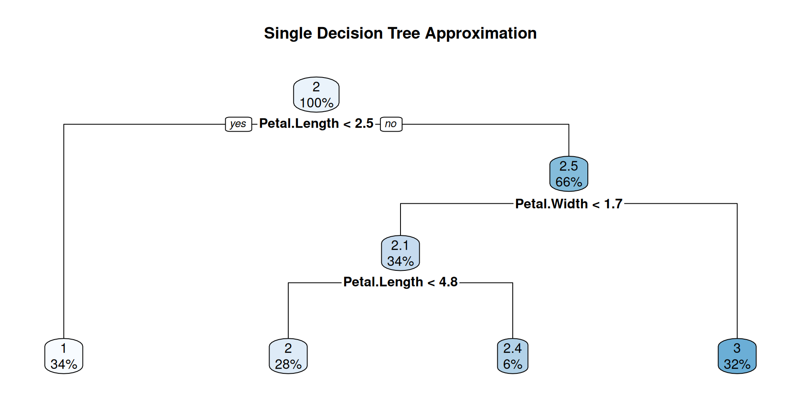
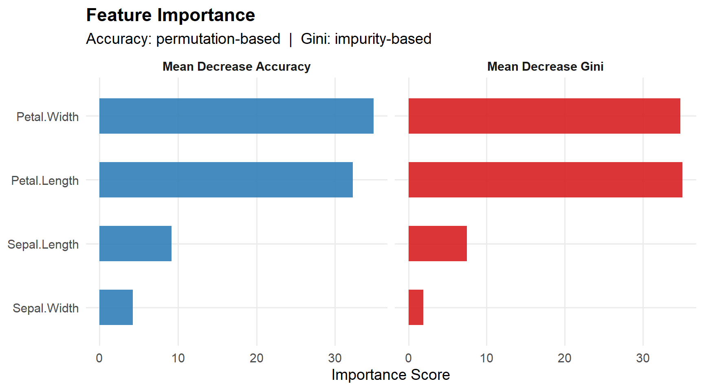
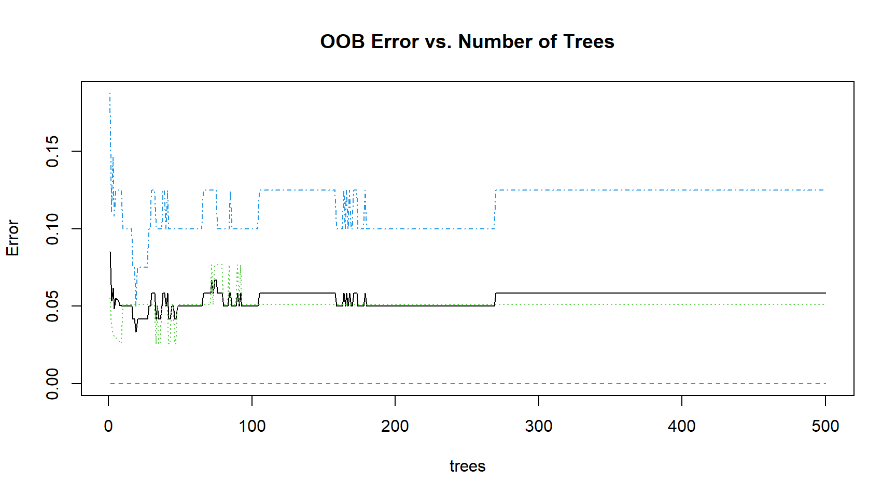

# Mathematical Foundation

## Introduction

Random forests are an ensemble learning method 

- They combine many decision trees into a single model  
- Used for regression and classification
- Used with complex, nonlinear data

## Key Idea

- Build many different trees  
- Make them decorrelated
- Average their predictions

### Why It Works

- Individual trees → high variance  
- Averaging → reduces variance
- Result → more stable and accurate model

## Regression Trees
For regression, a tree partitions the feature space into regions 
$R_1, R_2, \dots, R_J$
, and predicts:

$\hat{f}(x) = \sum_{j=1}^{J} c_j \mathbf{1}(x \in R_j)$

where 
$c_j$ 
is typically the mean of the response values in region 
$R_j$
.

Splits are chosen to minimize residual sum of squares (RSS):

$\sum_{i: x_i \in R_1} (y_i - \bar{y}_{R_1})^2 + \sum_{i: x_i \in R_2} (y_i - \bar{y}_{R_2})^2$

## Classification Trees
For classification, trees predict class labels using majority vote within each region.

Splits are chosen to reduce impurity, commonly using:

- **Gini Index**:

$G = \sum_{k=1}^{K} p_k (1 - p_k)$

- **Entropy**:

$H = -\sum_{k=1}^{K} p_k \log p_k$

where 
$p_k$
is the proportion of class
$k$
in a node.

## Random Forest Algorithm

A random forest builds 
$B$
trees using two sources of randomness:

### 1. Bootstrap Sampling
For each tree 
$b = 1, \dots, B$
, draw a bootstrap sample from the data.

### 2. Random Feature Selection
At each split, select a random subset of $m$ features (with $m < p$) and choose the best split only among those features.

## Why Random Forests Work

Let each tree have variance 
$\sigma^2$ 
and pairwise correlation 
$\rho$
. Then the variance of the ensemble is approximately:

$\text{Var}(\hat{f}) \approx \rho \sigma^2 + \frac{1 - \rho}{B} \sigma^2$

Key insight:

- Increasing  
$B$
reduces variance
- Reducing correlation 
$\rho$ 
(via feature randomness) is crucial

## Assumptions

Random forests make fewer assumptions than parametric models, but still rely on:

- Independent Observation
- The training set is representative of the population
- Variables must provide information on the dependent variable
- Predictions must be within the range of the training data

## Out-of-Bag (OOB) Error Estimation

Each tree is trained on a bootstrap sample, leaving about 
$\approx 1/3$ 
of observations unused.

For each observation, predictions from trees where it was not included are averaged:

$\hat{f}_{\text{OOB}}(x_i) = \frac{1}{|\mathcal{B}_i|} \sum_{b \notin \mathcal{B}_i} T_b(x_i)$

This provides an unbiased estimate of generalization error.

## Shortcomings

- Lack of Interpretability
- Computational Cost
- Bias in High-Dimensional Sparse Settings
- Poor Extrapolation
- Correlated Features

## Real-World Applications

- **Healthcare**
  - Predicting disease risk
  - Identifying important risk factors  

- **Finance**
  - Credit scoring (loan approval decisions)  
  - Fraud detection in transactions  

- **Marketing**
  - Customer churn prediction  
  - Targeted advertising  

## Summary

Random forests improve upon decision trees by:

- Reducing variance through averaging
- Reducing correlation via random feature selection

They are a flexible, powerful tool that performs well in practice with minimal tuning, making them a strong choice for both regression and classification tasks.


# Regression 

## AMES Housing Data
- 2,930 homes, 81 variables
- Predicting Sale_Price from everything else


::: {.cell}
::: {.cell-output-display}
`````{=html}
<table class="table" style="font-size: 20px; margin-left: auto; margin-right: auto;">
 <thead>
  <tr>
   <th style="text-align:right;"> Sale_Price </th>
   <th style="text-align:right;"> Gr_Liv_Area </th>
   <th style="text-align:left;"> Overall_Qual </th>
   <th style="text-align:right;"> Year_Built </th>
   <th style="text-align:left;"> Neighborhood </th>
   <th style="text-align:right;"> Total_Bsmt_SF </th>
  </tr>
 </thead>
<tbody>
  <tr>
   <td style="text-align:right;"> 215000 </td>
   <td style="text-align:right;"> 1656 </td>
   <td style="text-align:left;"> Above_Average </td>
   <td style="text-align:right;"> 1960 </td>
   <td style="text-align:left;"> North_Ames </td>
   <td style="text-align:right;"> 1080 </td>
  </tr>
  <tr>
   <td style="text-align:right;"> 105000 </td>
   <td style="text-align:right;"> 896 </td>
   <td style="text-align:left;"> Average </td>
   <td style="text-align:right;"> 1961 </td>
   <td style="text-align:left;"> North_Ames </td>
   <td style="text-align:right;"> 882 </td>
  </tr>
  <tr>
   <td style="text-align:right;"> 172000 </td>
   <td style="text-align:right;"> 1329 </td>
   <td style="text-align:left;"> Above_Average </td>
   <td style="text-align:right;"> 1958 </td>
   <td style="text-align:left;"> North_Ames </td>
   <td style="text-align:right;"> 1329 </td>
  </tr>
  <tr>
   <td style="text-align:right;"> 244000 </td>
   <td style="text-align:right;"> 2110 </td>
   <td style="text-align:left;"> Good </td>
   <td style="text-align:right;"> 1968 </td>
   <td style="text-align:left;"> North_Ames </td>
   <td style="text-align:right;"> 2110 </td>
  </tr>
  <tr>
   <td style="text-align:right;"> 189900 </td>
   <td style="text-align:right;"> 1629 </td>
   <td style="text-align:left;"> Average </td>
   <td style="text-align:right;"> 1997 </td>
   <td style="text-align:left;"> Gilbert </td>
   <td style="text-align:right;"> 928 </td>
  </tr>
  <tr>
   <td style="text-align:right;"> 195500 </td>
   <td style="text-align:right;"> 1604 </td>
   <td style="text-align:left;"> Above_Average </td>
   <td style="text-align:right;"> 1998 </td>
   <td style="text-align:left;"> Gilbert </td>
   <td style="text-align:right;"> 926 </td>
  </tr>
</tbody>
</table>

`````
:::
:::


## Correlation Plot

::: {.cell}
::: {.cell-output-display}
{width=960}
:::
:::


## Random Forest Model 

::: {.cell}
::: {.cell-output .cell-output-stdout}

```

Call:
 randomForest(formula = Sale_Price ~ ., data = train, ntree = 500,      mtry = floor((ncol(train) - 1)/3), importance = TRUE) 
               Type of random forest: regression
                     Number of trees: 500
No. of variables tried at each split: 26

          Mean of squared residuals: 631025284
                    % Var explained: 89.81
```


:::
:::


## Random Forest Tree Tuning


::: {.cell}
::: {.cell-output-display}
{width=960}
:::
:::


## Random Forest mtry Tuning


::: {.cell}

:::


::: {.cell}
::: {.cell-output .cell-output-stdout}

```
-0.02543525 0.01 
-0.05078364 0.01 
```


:::

::: {.cell-output-display}
{width=960}
:::

::: {.cell-output .cell-output-stdout}

```
   mtry  OOBError
18   18 638525174
26   26 622686976
39   39 654309286
```


:::
:::


## Tuned Random Forest Model


::: {.cell}
::: {.cell-output .cell-output-stdout}

```

Call:
 randomForest(formula = Sale_Price ~ ., data = train, ntree = 200,      mtry = 26, importance = TRUE) 
               Type of random forest: regression
                     Number of trees: 200
No. of variables tried at each split: 26

          Mean of squared residuals: 631345965
                    % Var explained: 89.81
```


:::
:::


## Model Evaluation


::: {.cell}

:::


::::{.columns}
::: {.column width="20%"}


::: {.cell}
::: {.cell-output-display}
`````{=html}
<table class="table" style="font-size: 20px; width: auto !important; margin-left: auto; margin-right: auto;">
 <thead>
  <tr>
   <th style="text-align:left;"> Metric </th>
   <th style="text-align:left;"> Value </th>
  </tr>
 </thead>
<tbody>
  <tr>
   <td style="text-align:left;"> Test RMSE </td>
   <td style="text-align:left;"> $25,154 </td>
  </tr>
  <tr>
   <td style="text-align:left;"> Test R² </td>
   <td style="text-align:left;"> 0.911 </td>
  </tr>
  <tr>
   <td style="text-align:left;"> OOB RMSE </td>
   <td style="text-align:left;"> $25,127 </td>
  </tr>
</tbody>
</table>

`````
:::
:::


:::
::: {.column width="40%"}


::: {.cell}
::: {.cell-output-display}
{width=384}
:::
:::


:::
::: {.column width="40%"}


::: {.cell}
::: {.cell-output-display}
{width=384}
:::
:::


:::
::::

## Feature Importance

:::: {.columns}
::: {.column width="60%"}


::: {.cell}
::: {.cell-output-display}
{width=1344}
:::
:::


:::
::: {.column width="40%"}

<div style="font-size: 0.6em;">

When we scramble *variable* values in the OOB data, the model's MSE increases by *value*%.

Variables at the bottom either carry redundant information already captured by other predictors, or have no real relationship to price at all. Either way, the model isn't using them meaningfully. When we permute these unused variables, the MSE barely changes — it wobbles randomly above or below the original value. Negative values aren't evidence that the variable was harmful; they're just what noise looks like around zero when a variable has no true importance.

</div>

:::
::::


# Classification

## Building The Model {.smaller}

:::: {.columns}


::: {.cell}

:::


::: {.column width="60%"}

::: {.cell}
::: {.cell-output .cell-output-stdout}

```

Call:
 randomForest(formula = Species ~ ., data = trainData, type = "classification",      importance = T, proximity = T) 
               Type of random forest: classification
                     Number of trees: 500
No. of variables tried at each split: 2

        OOB estimate of  error rate: 5.83%
Confusion matrix:
           setosa versicolor virginica class.error
setosa         41          0         0  0.00000000
versicolor      0         37         2  0.05128205
virginica       0          5        35  0.12500000
```


:::
:::

:::
::: {.column width="40%"}
Out-of-Bag Error Rate: $\frac{1}{n} \sum_{i=1}^{n} \mathbf{1}\left( y_i \neq \hat{y}_i^{\text{OOB}} \right)$

- If the majority vote prediction for observation $i$ using only the trees that did not feature observation $i$ in their training subset is not equal to the true label for observation $i$, then we set to 1. 0 otherwise.
- Hyperparameters: Number of trees and No. of variables tried at each split (mtry)

:::
::::

## Singular Decision Tree


::: {.cell}
::: {.cell-output-display}
{width=960}
:::
:::


## Feature Influence{.smaller}


::: {.cell}
::: {.cell-output-display}
{width=864}
:::
:::


## Learning Curve — OOB Error vs. Trees {.smaller}


::: {.cell}
::: {.cell-output-display}
{width=864}
:::
:::


## Model Evaluation {.smaller}


::: {.cell}
::: {.cell-output .cell-output-stdout}

```
Confusion Matrix and Statistics

            Reference
Prediction   setosa versicolor virginica
  setosa          9          0         0
  versicolor      0         10         1
  virginica       0          1         9

Overall Statistics
                                          
               Accuracy : 0.9333          
                 95% CI : (0.7793, 0.9918)
    No Information Rate : 0.3667          
    P-Value [Acc > NIR] : 1.145e-10       
                                          
                  Kappa : 0.8997          
                                          
 Mcnemar's Test P-Value : NA              

Statistics by Class:

                     Class: setosa Class: versicolor Class: virginica
Sensitivity                    1.0            0.9091           0.9000
Specificity                    1.0            0.9474           0.9500
Pos Pred Value                 1.0            0.9091           0.9000
Neg Pred Value                 1.0            0.9474           0.9500
Prevalence                     0.3            0.3667           0.3333
Detection Rate                 0.3            0.3333           0.3000
Detection Prevalence           0.3            0.3667           0.3333
Balanced Accuracy              1.0            0.9282           0.9250
```


:::
:::


# Hyperparameter Tuning

## Random Search for Hyperparameter Tuning


::: {.cell}
::: {.cell-output .cell-output-stdout}

```

Best Hyperparameters (Random Search):
```


:::

::: {.cell-output .cell-output-stdout}

```
   mtry  splitrule min.node.size
13    3 extratrees            14
```


:::

::: {.cell-output .cell-output-stdout}

```
Best ntree: 50 
```


:::
:::


## Did we improve?


::: {.cell}
::: {.cell-output .cell-output-stdout}

```

Call:
 randomForest(formula = Species ~ ., data = trainData, type = "classification",      importance = T, proximity = T, ntree = 50, mtry = 2, nodesize = 14) 
               Type of random forest: classification
                     Number of trees: 50
No. of variables tried at each split: 2

        OOB estimate of  error rate: 4.17%
Confusion matrix:
           setosa versicolor virginica class.error
setosa         41          0         0  0.00000000
versicolor      0         37         2  0.05128205
virginica       0          3        37  0.07500000
```


:::
:::


# Questions
